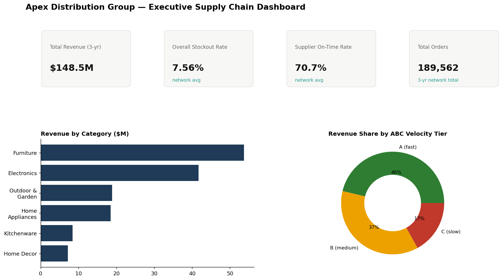
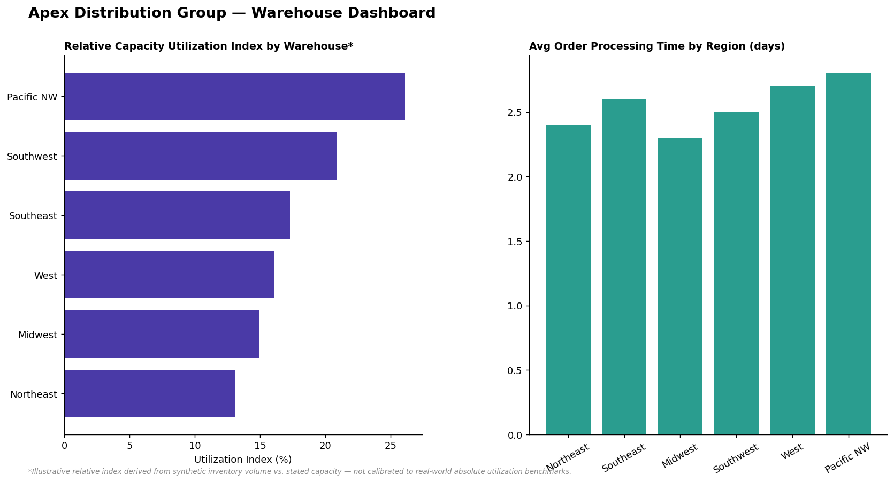
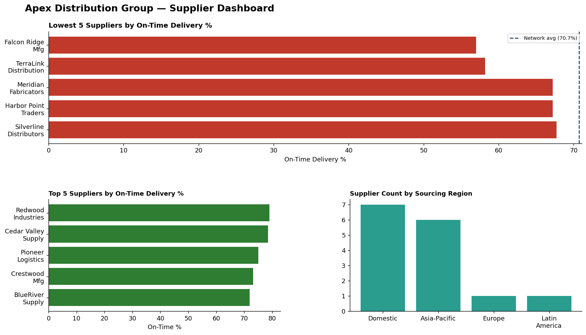
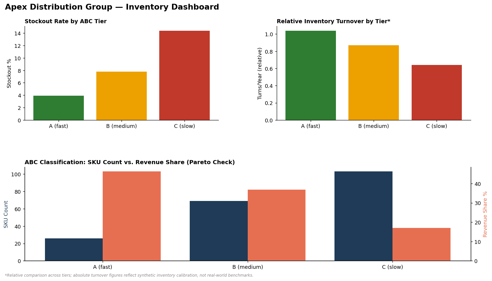
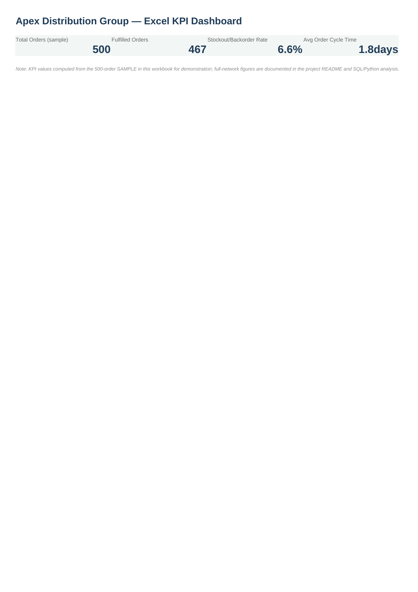

# Apex Distribution Group — Supply Chain & Inventory Intelligence


## Business Problem

Apex Distribution Group — a global consumer goods distributor with 6 regional
distribution centers, 15 suppliers, and ~200 SKUs — faces frequent stockouts,
supplier delivery delays, and uneven fulfillment performance. Leadership
needs the actual root causes identified before committing capital to a fix,
not just a list of symptoms.

## Dataset

**This dataset is entirely synthetic.** Real combined supplier/warehouse/
order-level supply chain data at this granularity isn't available as a
public dataset. A generator (`data/generate_data.py`) built 390,079 rows
across purchase orders, customer orders, and inventory snapshots
(2023-2025), with deliberate, documented realistic patterns (ABC-skewed
product velocity, variable supplier reliability, seasonal demand surges) so
the analysis has genuine signal to uncover.

## Executive Supply Chain Dashboard



## Warehouse Dashboard



## Supplier Dashboard



## Inventory Dashboard



## Key Findings

1. **Revenue is genuinely concentrated (ABC/Pareto confirmed)**: the top 26
   SKUs (13% of the catalog) generate 46.3% of revenue.
2. **Stockout rate rises sharply and predictably by product tier**: A=3.9%,
   B=7.8%, C=14.4% (chi-square p<0.001, n=189,562).
3. **Supplier lead time does NOT significantly explain stockouts**
   (r=-0.118, p=0.097) — an honest near-null result. Demand volatility, not
   supplier delay, is the dominant driver.
4. **A striking channel fulfillment gap**: Store hits a 91.4% perfect-order
   rate vs. just 68.9% for Online — a 22.5-point gap on the same catalog.
5. **Network-wide supplier on-time rate is only 70.7%** — even the best
   supplier caps out at 79%, suggesting a systemic issue, not a few bad
   vendors.

*(Full list: 15 insights, 10 risks, 15 recommendations, 10 quick wins, 10
long-term opportunities in [`docs/business_insights.md`](docs/business_insights.md).)*

## Top 3 Recommendations

1. Launch a dedicated Online fulfillment process review — the highest-
   confidence gap identified.
2. Prioritize demand-forecasting and safety-stock investment for C-tier
   products over supplier-focused fixes, since the data shows demand
   volatility (not supplier delay) drives stockouts.
3. Recalibrate the overstock-detection threshold before using it for any
   markdown decision — the current version flags 100% of products, meaning
   it provides zero decision-making value as-is.

## Excel Dashboard



Pivot-style summaries, conditional formatting, VLOOKUP/INDEX-MATCH — see
[`Excel/apex_supply_chain_dashboard.xlsx`](Excel/apex_supply_chain_dashboard.xlsx).

## Critical Assessment & Next Steps

A supply chain analysis that stops at "here are the dashboards" isn't
finished. Full limitations documented in
[`docs/business_insights.md`](docs/business_insights.md), headline items:

- This dataset is synthetic — every number is illustrative.
- Three calibration artifacts were caught and reported honestly rather than
  hidden: unrealistic absolute inventory turnover, a warehouse utilization
  index that isn't a real benchmark, and an overstock threshold that flagged
  literally every product (a sign the threshold needs recalibration, not a
  real finding).
- The supplier lead-time/stockout link was tested directly and came back
  non-significant — redirecting the recommendation priority accordingly.

## Project Contents

| Folder | Contents |
|---|---|
| [`SQL/`](SQL) | Star-schema design + 10 queries (ABC classification, supplier risk scoring, overstock flagging) |
| [`notebooks/`](notebooks) | EDA, chi-square/correlation testing, demand forecasting |
| [`Excel/`](Excel) | KPI workbook — pivots, conditional formatting, VLOOKUP/INDEX-MATCH |
| [`data/`](data) | Synthetic data generator |
| [`docs/`](docs) | Full insights/recommendations report |

**SQL highlight** (ABC classification via revenue Pareto — full query in
[`SQL/02_analysis_queries.sql`](SQL/02_analysis_queries.sql)):
```sql
ROW_NUMBER() OVER (ORDER BY revenue DESC) AS rank_by_revenue,
ROUND(SUM(revenue) OVER (ORDER BY revenue DESC ROWS UNBOUNDED PRECEDING)
      / SUM(revenue) OVER () * 100, 1) AS cumulative_pct
```

## Tools & Techniques

SQL (window functions, CTEs, Pareto/ABC analysis, compound risk scoring) ·
Statistics (chi-square, Pearson correlation) · Time series forecasting
(Holt-Winters) · Excel (pivot-style summaries, conditional formatting,
VLOOKUP/INDEX-MATCH) · Power BI dashboard design · Root-cause analysis

---

© 2026 Temaje Zakaria. All rights reserved.
